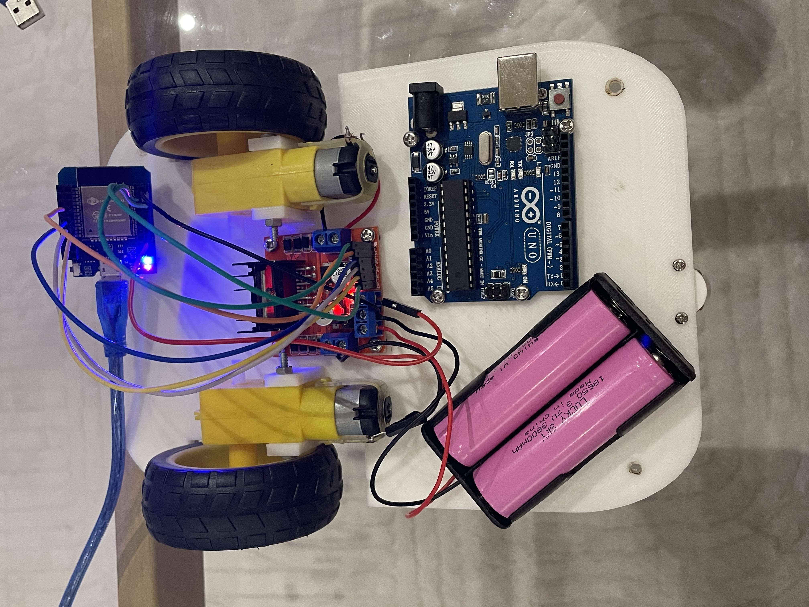
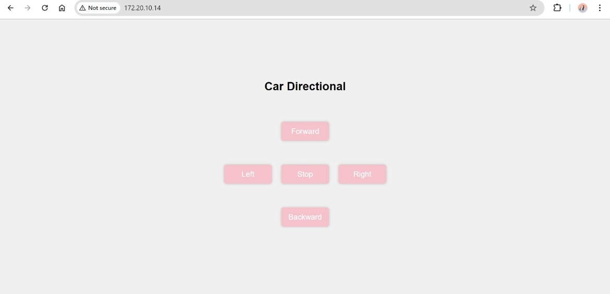
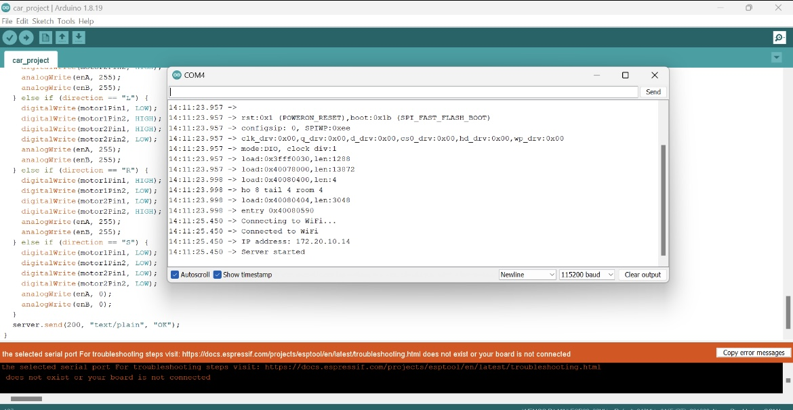

# ESP32 Car Control
This project demonstrates how to build and control a simple car using an ESP32 microcontroller. The car is equipped with two DC motors connected through an H-bridge, and it is powered by a 9V battery. The car's movements (forward, backward, left, right, stop) are controlled via a web interface served directly from the ESP32. This guide provides all the necessary steps to build, connect, and program the car.

## Overview
This project allows you to control a car using an ESP32 microcontroller and a web interface. The web server hosted on the ESP32 provides buttons to send commands to the car, which directly control its movement.

## Hardware Requirements
- ESP32 microcontroller
- 2 DC motors with wheels
- L298N H-Bridge motor driver
- 9V battery
- Jumper wires
- Breadboard (optional)

## Circuit Diagram
Include a diagram showing how the ESP32, DC motors, H-bridge, and battery are connected. This will help others replicate your setup.

## Building the Circuit
1. Connect the DC motors to the output terminals of the L298N H-Bridge.
2. Connect the H-Bridge input pins to the following ESP32 GPIO pins:
- IN1 to GPIO 5 (motor1Pin1)
- IN2 to GPIO 23 (motor1Pin2)
- IN3 to GPIO 19 (motor2Pin1)
- IN4 to GPIO 18 (motor2Pin2)
3. Connect the ENA pin of the H-Bridge to GPIO 25 (enA).
4. Connect the ENB pin of the H-Bridge to GPIO 27 (enB).
5. Connect the 9V battery to the power input of the H-Bridge.
6. Connect the ESP32 to your computer via USB for programming.

## Web Interface
The web interface consists of a simple HTML page with buttons to control the car's movement. The interface is served directly from the ESP32 and allows for real-time control of the car.

## Testing and Demonstration
After uploading the code to the ESP32, open the serial monitor to find the IP address of your ESP32. Enter this IP address in your web browser to access the control interface. Use the buttons to move the car forward, backward, left, right, or

## How It Works
- Connect the ESP32 to WiFi: The ESP32 connects to your WiFi network using the provided SSID and password.
- Start the web server: The ESP32 starts a web server and listens for incoming connections.
- Control the motors: When a button is pressed on the web

watch the video demonstration [here](IMG_5580.mp4).
